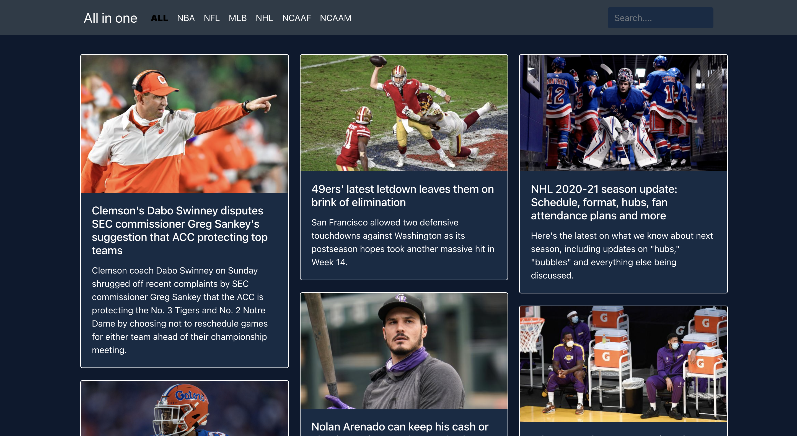

# All In One Sports



## General Info

Web app that displays popular articles of all major sports

## Demo

You can view it here - [All-in-one-sports](https://all-in-one-sports.netlify.app)

## Made With

- JavaScript ES6
- React
- React-Bootstrap
- Styled Components
- HTML/CSS
- API
- And of course... ☕️

## Installation

1. Clone the repo

   ```
   git clone https://github.com/cadellsingh/All-in-one-sports-page.git
   ```

2. Change working directory

   ```
   cd All-in-one-sports-page/
   ```

3. Install any dependencies

   ```
   yarn install
   ```

4. Run application

   ```
   yarn start
   ```


